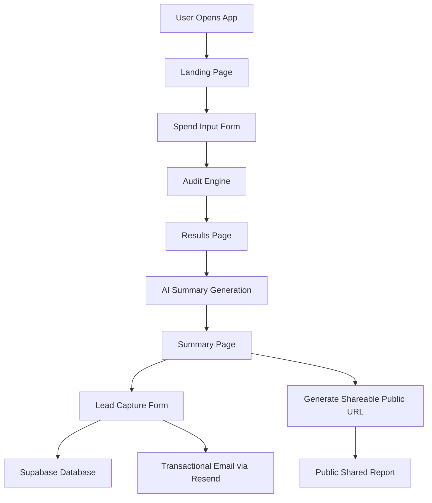

# Credex AI Spend Audit — Architecture

## System Overview

---

# Stack Choices

## Frontend
- React + Vite
- TailwindCSS
- React Router DOM

Chosen because:
- fast development speed
- component reuse
- clean routing
- lightweight deployment

## Backend
- Express.js
- Node.js

Chosen because:
- simple API routes
- easy email integration
- fast local development

## Database
- Supabase

Chosen because:
- managed Postgres
- simple REST APIs
- authentication + storage support
- fast setup for MVP development

## Email Infrastructure
- Resend

Chosen because:
- developer-friendly API
- easy transactional email support
- free tier available

## AI Layer
- Anthropic Claude API

Chosen because:
- strong summarization quality
- stable prompt outputs
- reliable structured responses

---

# Data Flow

1. User enters AI tool subscriptions and spend data.
2. Frontend stores form state locally for persistence.
3. Audit engine evaluates:
   - plan optimization
   - cheaper alternatives
   - unnecessary enterprise upgrades
   - savings opportunities
4. Results are rendered dynamically.
5. Summary page generates AI-based personalized explanation.
6. User can submit lead information.
7. Lead data is stored in Supabase.
8. Transactional audit email is sent through Resend.
9. Public shareable URL is generated with anonymized company details.

---

# Scaling to 10k Audits / Day

If scaling to production volume:
- move backend to serverless infrastructure
- introduce Redis caching for pricing lookups
- queue email delivery with background workers
- move audit calculations to isolated services
- implement rate limiting at API gateway level
- store pricing snapshots separately
- add monitoring + observability dashboards